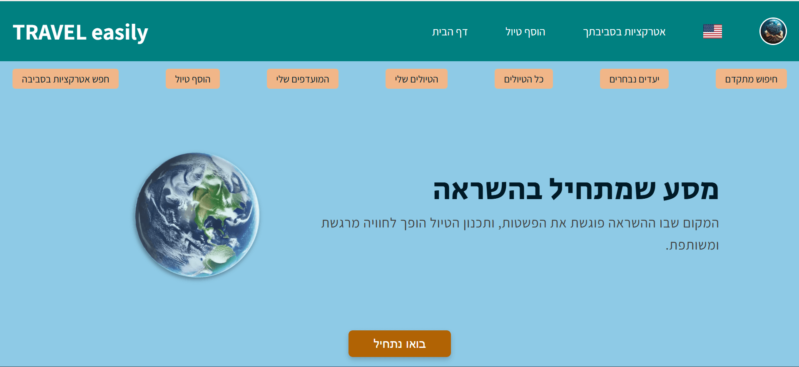

# Travel Easily - Share Your Journey

## Description

Travel Easily is a community-based travel sharing application where users can register, upload a profile picture, and start posting detailed travel routes. Each post can include a number of days, country, type of trip, type of traveler, daily activities, and images from the trip.

## Features

- User authentication (including Google sign-in).
- Create posts with detailed descriptions and images of travel routes.
- View posts from all users or only your own posts.
- Comment on posts and like them, with real-time updates via Socket.IO.
- Edit and delete posts and images.
- Update profile picture and delete user account entirely.
- Images are stored using Cloudinary.
- Multi-language support: The application supports both Hebrew and English, implemented with react-i18next.

## Technologies

- **React (TypeScript)** for frontend development.
- **React Router** for page navigation.
- **Context API** for global state management.
- **Socket.IO** for real-time communications.
- **Google OAuth** for secure and convenient user authentication.
- **Cloudinary** for image storage.
- **react-i18next** for multilingual support.
- **CSS Modules** for modular and managed styling.
- **Netlify** for hosting the application.

## Custom Hooks

- `useImageUpload` - A hook for uploading images to Cloudinary.
- `useSocket` - Manages Socket.IO communications.
- `useTripCard` - Manages the state of travel cards.
- `useTripData` - Fetches and updates data on travels.

## Project Setup

To run the project in a development environment:

```bash
npm install     # Install dependencies
npm run dev     # Start the development server


```

## Live Site

The application is live at [Travel Easily](https://travel-easily-app.netlify.app/register) .

## Author

David Erenfeld

## Screenshots

Below are some screenshots demonstrating the features and design of the application:

### Desktop Screenshots





### Mobile Screenshots


